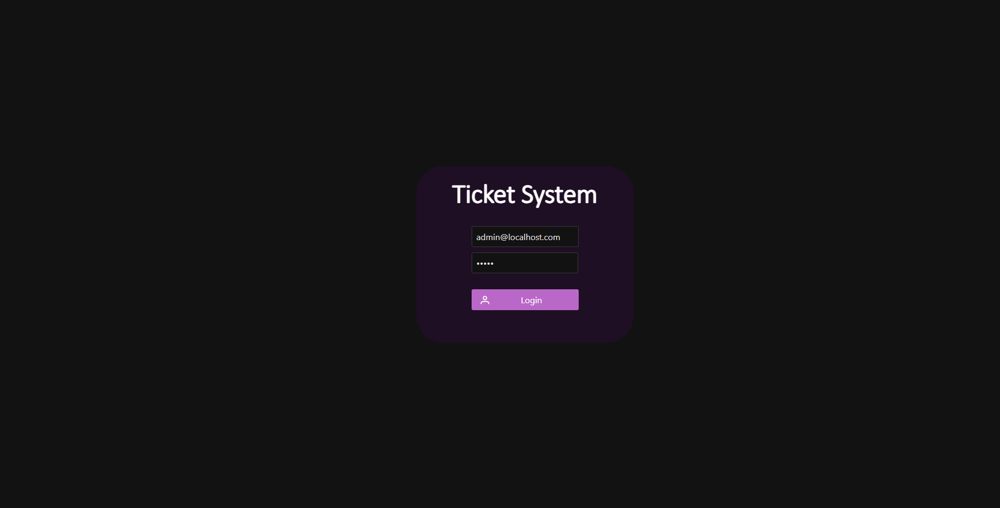
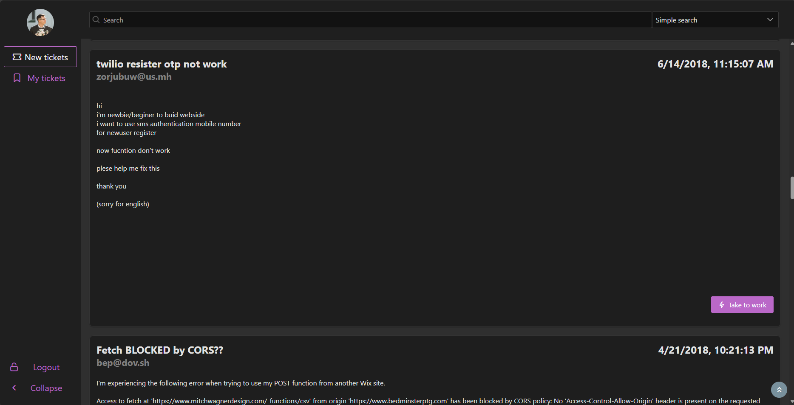
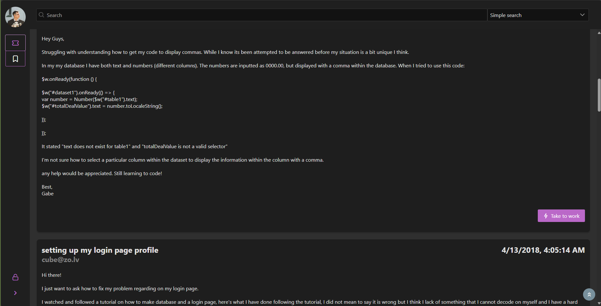

# OpenSource Ticket System - Frontend part
$${\color{red}Still}$$ $${\color{red}in}$$ $${\color{red}development}$$ 🚧
Backend for the project is here: https://github.com/piratinskii/Ticket-System-Backend

## Project Description

OpenSource TicketSystem is a simple and intuitive ticketing system with a basic web interface, developed as a pet project. The backend is written in FastAPI (Python),
and the frontend is developed using VueJS (JavaScript). The project is in the early stages of development and provides essential features for ticket management.

## Core Features

- [x] User Authentication and Registration: Users can register and log in to the system to manage tickets.
- [x] Ticket Creation: Users can create new tickets with all necessary details.
- [x] Ticket Viewing: Ability to view the details of a ticket.
- [x] Ticket Closure: Users can close tickets once the issue is resolved.
- [x] Ticket Assignment: Tickets can be assigned to specific users for resolution.
- [x] Ticket List: View all tickets in the system.
- [x] Ticket Search: Ability to search for tickets by title, creation time, and other fields.

## Planned Features

- [ ] Complete User Interface: Develop a fully functional user interface.
- [ ] Integrations: Integrate with messengers and other systems for ticket creation.
- [ ] Lifecycle Management: Manage the entire lifecycle of a ticket.
- [ ] Notifications: Send notifications about ticket updates via email or messengers.
- [ ] Role-Based Access Control: Introduce role-based access control to manage user permissions and access levels.


## Pre-installation
<a name="pre-installation"></a>
#### npm

Please, install npm if it's not already installed. Just follow this official manual: https://docs.npmjs.com/downloading-and-installing-node-js-and-npm

#### OpenSSL

Please, instal OpenSSL if it's not already installed. Just follow this official manual: https://openssl-library.org/source/index.html

## Installation 

1. Clone the repository (use these commands in the terminal):    
   ```git clone https://github.com/piratinskii/Ticket-System-Frontend.git```
   
   ```cd Ticket-System-Frontend``` 

2. Make sure npm and OpenSSL are already installed (see [Pre-Installation section](#pre-installation))

3. Generate SSL key and certificate for the server (or you can use your own):
```
openssl genpkey -algorithm RSA -out server.key
openssl req -new -key server.key -out server.csr -subj "/CN=localhost" -config openssl.cnf
openssl x509 -req -days 365 -in server.csr -signkey server.key -out server.crt
```
4. Install the dependencies: 
```npm install```

## Usage 

Run the server: 

```npm run dev```

Go to the main page and enjoy:
```https://localhost:5173/``` in your browser

## Addiditional information:

If there are no users in the database, the program automatically creates a user with the following credentials:

- **Email**: admin@localhost.com
- **Password**: admin

## Screenshots:

- Login page:


- Expanded main view:


- Collapsed main view:

